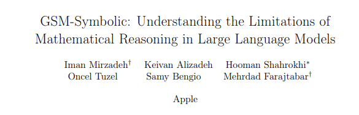

# IA Generativa como Servicio

Analizaremos cómo ofrecer soluciones de Inteligencia Artigicial (AI) generativa (GenAI) como servicios escalables y personalizados para diferentes industrias y veticales de negocio. Veremos los componentes fundamentales que permiten la integración fluida de modelos generativos en aplicaciones empresariales.

## ¿Qué es la GenAI?

En términos generales, hoy día distingimos dos tipos de aplicaciones de la Inteligencia Artificial:

1 - La IA Predictiva → Es la capacidad de un programa para utilizar el análisis estadístico y grandes cantidades de datos para identificar patrones, anticipar comportamientos y prever eventos futuros. El campo de la estadística se ha utilizado durante mucho tiempo para hacer predicciones sobre el futuro, y la IA predictiva hace que dicho análisis sea más rápido y (teóricamente) más preciso mediante el aprendizaje automático. Aunque sus predicciones no están garantizadas, la IA predictiva puede ayudar a las organizaciones a prepararse para el futuro y personalizar las experiencias de sus clientes. Habitualmente, a este tipo de aplicaciones de la IA se la conoce de forma generalista como Machine Learning.

2 - La IA Generativa → Es la capacidad de un programna para predecir probabilísticamente cuál es la continuación, salida o respuesta esperada a una entrada proporcionada a partir de un conjunto enorme de datos con los cuales ha sido preentrenado. No predice un resultado, sino que genera un contenido (texto, imágen, vídeo o sonido) a partir de la propabilidad de que sea el resultado esperado. Son procesos estocásticos, es decir, que una misma entrada no necesariamente producirá la misma salida, ya que existe una cierta aleatoriedad en la probabilidad con la que genera el contenido que proporciona.

| IA Generativa vs. IA Predictiva                                                                          |
| -------------------------------------------------------------------------------------------------------- |
| La IA generativa crea contenido y traduce datos en diferentes formatos.                                  |
| La IA predictiva hace predicciones y toma decisiones utilizando técnicas de IA y aprendizaje automático. |
| Las dos varían en casos de uso y en la competencia con datos no estructurados y estructurados.           |

|                  | IA Generativa                                                                  | IA Predictiva                                                                                             |
| ---------------- | ------------------------------------------------------------------------------ | --------------------------------------------------------------------------------------------------------- |
| **BENEFICIOS**   | - Automatiza el desarrollo de software                                         | - Automatiza análisis                                                                                     |
|                  | - Simplifica la generación de nuevo contenido                                  | - Simplifica análisis complejos                                                                           |
|                  | - Resume documentos complejos                                                  | - Optimiza el procesamiento de datos                                                                      |
|                  | - Trabaja con datos no estructurados                                           | - Trabaja con datos estructurados                                                                         |
|                  | - Crea respuestas a consultas complejas                                        | - Mejora el análisis de casos de uso bien comprendidos                                                    |
|                  | - Trabaja con texto, video, audio, instrucciones de robots y formatos de datos | - Funciona bien con datos estructurados y de series temporales                                            |
|                  |                                                                                |                                                                                                           |
| **LIMITACIONES** | - Propenso a alucinaciones de IA                                               | - El sesgo en los datos subyacentes puede amplificarse                                                    |
|                  | - Alta huella de carbono                                                       | - Depende en gran medida de datos históricos                                                              |
|                  | - Puede ser costoso reentrenar modelos                                         | - La transparencia y explicabilidad pueden ser difíciles                                                  |
|                  | - Difícil eliminar datos sensibles de un modelo                                | - El sobreajuste a los datos de entrenamiento puede llevar a predicciones inexactas o sesgo de predicción |
|                  | - Difícil explicar los mecanismos subyacentes a los resultados                 | - Dificultad para distinguir entre correlación y causalidad                                               |

## La GenAI − por ahora − no razona

A día de hoy, aunque las Inteligencias Artificiales Generativas son muy poderosas produciendo contenido, realmente no son capaces de razonar o tener critériso sobre lo que se les pide. Esto es más una ilusión nuestra como humanos ante el resultado tan espectacular que a veces recibimos de utilizar estas tecnologías. Sin embargo, es muy importante y fundamental entender esto.

Por ejemplo, cuando se le pide a un modelo de GenAI que realice la comparación entre dos o más cosas, lo que realmente ocurre es que se retorna el texto que más probabilidad tiene de ser estadísticamente el resultado esperado. No hay un proceso de dicernimiento o razonamiento que realmente realice una comparación o análisis, sino que simplemente hay un mecanismo de generación de información. Algo así como tener a una persona que no piensa lo que dice sino que dice lo que cree que tu quieres escuchar.

En ese sentido, es importante destacar que se realizan constantes estudios para determinar la capacidad de "pensamiento" de este tipo de IAs:

