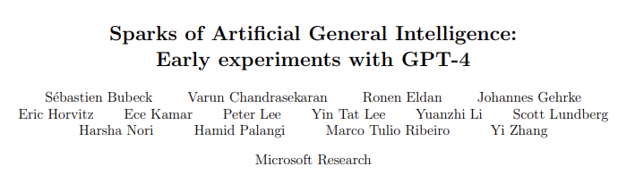
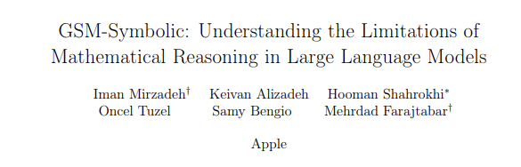
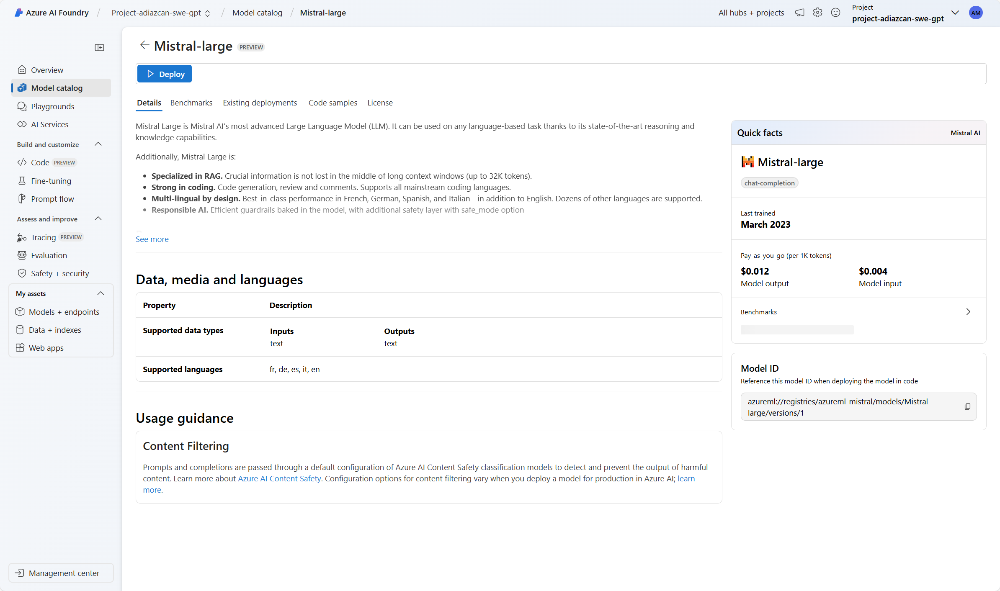
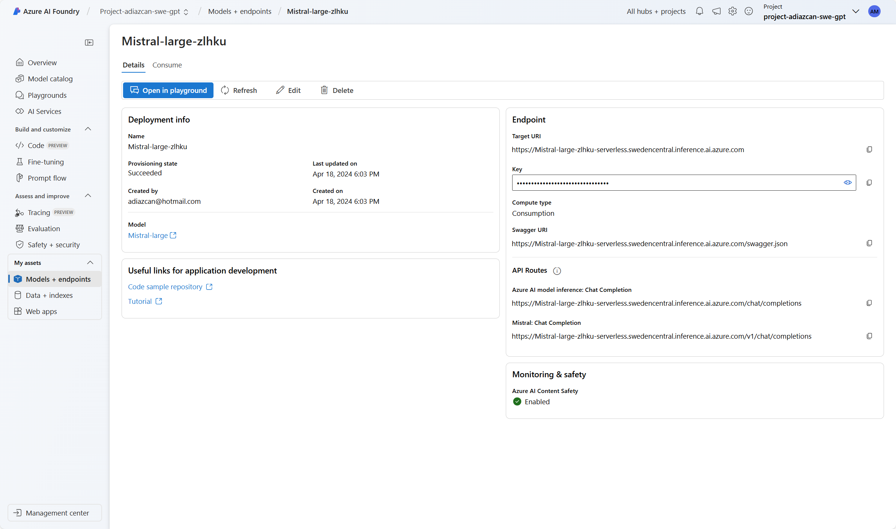

# IA Generativa como Servicio

Analizaremos cómo ofrecer soluciones de Inteligencia Artigicial (AI) generativa (GenAI) como servicios escalables y personalizados para diferentes industrias y veticales de negocio. Veremos los componentes fundamentales que permiten la integración fluida de modelos generativos en aplicaciones empresariales.

## ¿Qué es la GenAI?

En términos generales, hoy día distingimos dos tipos de aplicaciones de la Inteligencia Artificial:

1 - La IA Predictiva → Es la capacidad de un programa para utilizar el análisis estadístico y grandes cantidades de datos para identificar patrones, anticipar comportamientos y prever eventos futuros. El campo de la estadística se ha utilizado durante mucho tiempo para hacer predicciones sobre el futuro, y la IA predictiva hace que dicho análisis sea más rápido y (teóricamente) más preciso mediante el aprendizaje automático. Aunque sus predicciones no están garantizadas, la IA predictiva puede ayudar a las organizaciones a prepararse para el futuro y personalizar las experiencias de sus clientes. Habitualmente, a este tipo de aplicaciones de la IA se la conoce de forma generalista como Machine Learning.

2 - La IA Generativa → Es la capacidad de un programna para predecir probabilísticamente cuál es la continuación, salida o respuesta esperada a una entrada proporcionada a partir de un conjunto enorme de datos con los cuales ha sido preentrenado. No predice un resultado, sino que genera un contenido (texto, imágen, vídeo o sonido) a partir de la propabilidad de que sea el resultado esperado. Son procesos estocásticos, es decir, que una misma entrada no necesariamente producirá la misma salida, ya que existe una cierta aleatoriedad en la probabilidad con la que genera el contenido que proporciona.

| IA Generativa vs. IA Predictiva                                                                          |
| -------------------------------------------------------------------------------------------------------- |
| La IA generativa crea contenido y traduce datos en diferentes formatos.                                  |
| La IA predictiva hace predicciones y toma decisiones utilizando técnicas de IA y aprendizaje automático. |
| Las dos varían en casos de uso y en la competencia con datos no estructurados y estructurados.           |

|                  | IA Generativa                                                                  | IA Predictiva                                                                                             |
| ---------------- | ------------------------------------------------------------------------------ | --------------------------------------------------------------------------------------------------------- |
| **BENEFICIOS**   | - Automatiza el desarrollo de software                                         | - Automatiza análisis                                                                                     |
|                  | - Simplifica la generación de nuevo contenido                                  | - Simplifica análisis complejos                                                                           |
|                  | - Resume documentos complejos                                                  | - Optimiza el procesamiento de datos                                                                      |
|                  | - Trabaja con datos no estructurados                                           | - Trabaja con datos estructurados                                                                         |
|                  | - Crea respuestas a consultas complejas                                        | - Mejora el análisis de casos de uso bien comprendidos                                                    |
|                  | - Trabaja con texto, video, audio, instrucciones de robots y formatos de datos | - Funciona bien con datos estructurados y de series temporales                                            |
|                  |                                                                                |                                                                                                           |
| **LIMITACIONES** | - Propenso a alucinaciones de IA                                               | - El sesgo en los datos subyacentes puede amplificarse                                                    |
|                  | - Alta huella de carbono                                                       | - Depende en gran medida de datos históricos                                                              |
|                  | - Puede ser costoso reentrenar modelos                                         | - La transparencia y explicabilidad pueden ser difíciles                                                  |
|                  | - Difícil eliminar datos sensibles de un modelo                                | - El sobreajuste a los datos de entrenamiento puede llevar a predicciones inexactas o sesgo de predicción |
|                  | - Difícil explicar los mecanismos subyacentes a los resultados                 | - Dificultad para distinguir entre correlación y causalidad                                               |

## La GenAI − por ahora − no razona

A día de hoy, aunque las Inteligencias Artificiales Generativas son muy poderosas produciendo contenido, realmente no son capaces de razonar o tener critériso sobre lo que se les pide. Esto es más una ilusión nuestra como humanos ante el resultado tan espectacular que a veces recibimos de utilizar estas tecnologías. Sin embargo, es muy importante y fundamental entender esto.

Por ejemplo, cuando se le pide a un modelo de GenAI que realice la comparación entre dos o más cosas, lo que realmente ocurre es que se retorna el texto que más probabilidad tiene de ser estadísticamente el resultado esperado. No hay un proceso de dicernimiento o razonamiento que realmente realice una comparación o análisis, sino que simplemente hay un mecanismo de generación de información. Algo así como tener a una persona que no piensa lo que dice sino que dice lo que cree que tu quieres escuchar.

En ese sentido, es importante destacar que se realizan constantes estudios para determinar la capacidad de "pensamiento" de este tipo de IAs:

Esto es importante de cara a las expectativas de lo que podemos o no construir, sobre todo de cara a lo que los usuarios estarían creando y ejecutando al usar la aplicación o servicios que creemos con estas tecnologías.

## Catálogo de modelos

El catálogo de modelos en el portal de **Azure AI Foundry** es el centro para descubrir y utilizar una amplia variedad de modelos para construir aplicaciones de inteligencia artificial generativa. Los modelos deben ser implementados para que estén disponibles y puedan recibir solicitudes de inferencia. El proceso de interactuar con un modelo implementado se denomina **inferencia**. Azure AI Foundry ofrece una completa gama de opciones de implementación para estos modelos, dependiendo de tus necesidades y los requisitos del modelo.

Las opciones de implementación en Azure AI Foundry varían según el tipo de modelo:

- **Modelos de Azure OpenAI**: Son los modelos más recientes de OpenAI, mejorados con características empresariales proporcionadas por Azure.

- **Modelos como Servicio (MaaS)**: Estos modelos no requieren cuota de cómputo de tu suscripción. Se implementan mediante una API sin servidor y se facturan por token en un modelo de pago por uso. 

- **Modelos abiertos y personalizados**: El catálogo de modelos ofrece acceso a una amplia variedad de modelos de acceso abierto en diferentes modalidades. Puedes alojar estos modelos en tu propia suscripción utilizando una infraestructura gestionada, máquinas virtuales y gestionar el número de instancias según la capacidad requerida. Entre los proveedores disponibles se incluyen Azure OpenAI, Hugging Face y NVIDIA. 

### ¿Cómo debo pensar en las opciones de implementación?

Azure AI Foundry anima a los clientes a explorar las opciones de implementación y elegir la que mejor se adapte a sus necesidades empresariales y técnicas.:

1. **Comienza con las opciones de implementación de mayor alcance**:  
   Esto te permitirá iterar y prototipar más rápidamente en tu aplicación sin tener que reconstruir tu arquitectura cada vez que decidas cambiar algo. El servicio de inferencia de modelos de Azure AI es un objetivo de implementación que soporta todos los modelos principales del catálogo de Azure AI, incluidas las últimas innovaciones de Azure OpenAI.

2. **Cuando busques utilizar un modelo específico**:

   - **Para modelos de Azure OpenAI**: Utiliza el **Azure OpenAI Service**, que ofrece una amplia gama de capacidades está diseñado específicamente para estos modelos.

   - **Para modelos de Modelos como Servicio (MaaS)**:  
     Si te interesa un modelo particular y no planeas usar ningún otro tipo de modelo, utiliza los **endpoints API sin servidor**. Esta opción permite implementar un modelo único con una URL y claves de endpoint específicas.

3. **Para modelos no disponibles en MaaS**:  
     Si tienes cuota de cómputo disponible en tu suscripción, utiliza **Compute Gestionado**, que admite la implementación de modelos abiertos y personalizados. Además, permite un alto nivel de personalización en el servidor de inferencia, los protocolos y la configuración detallada.

## Implementación de modelos como servicio (Serverless APIs)

Algunos modelos del catálogo de modelo se pueden implementar como una API sin servidor con la facturación de pago por uso. Este tipo de implementación proporciona una manera de consumir modelos como una API sin hospedarlos en la suscripción, a la vez que mantiene la seguridad empresarial y el cumplimiento que necesitan las organizaciones. Esta opción de implementación no requiere cuota de la suscripción.

En este ejemplo se usa una implementación de modelos de Mistral para ilustrarlo.

### Requisitos previos

- Una suscripción de Azure con un método de pago válido. Las suscripciones gratuitas o de evaluación de Azure no funcionarán.

- Un centro de Azure AI Studio.

- Un proyecto de Azure AI Studio.

- Los controles de acceso basado en rol de Azure (RBAC de Azure) se usan para conceder acceso a las operaciones en la inteligencia artificial de Azure Studio. Para realizar los pasos descritos en este artículo, la cuenta de usuario debe tener asignado el rol Desarrollador de Azure AI en el grupo de recursos. Para más información sobre los permisos, consulte control de acceso basado en rol en Inteligencia artificial de Azure Studio.

### Busque el modelo y el identificador del modelo en el catálogo de modelos

1. Inicie sesión en Azure AI Studio.
2. Si aún no está en el proyecto, selecciónelo.
3. Seleccione Catálogo de modelos en el panel de navegación izquierdo.
4. Seleccione la tarjeta de modelo del modelo que desea implementar. Seleccione el modelo Mistral-large.

   

5. Implemente el modelo y siga las intrucciones por defecto.

### Consumir el modelo implementado desde el Chat Playground

Una vez desplegado el modelo, es estado de provisionado es "Succeeded". Ahora puedes consumir el modelo desde el Chat Playground.

Prueba el modelo desde el Playground para comprobar que todo está funcionando correctamente.

## Consumo el modelo implementado usando la API de inferencia de Azure AI

La inferencia de modelos de Azure AI es una API que expone un conjunto común de funcionalidades para los modelos fundamentales y que los desarrolladores pueden usar para consumir predicciones de un conjunto diverso de modelos de forma uniforme y coherente. Los desarrolladores pueden hablar con diferentes modelos implementados en Inteligencia artificial de Azure Studio sin cambiar el código subyacente que usan.

La API indica cómo los desarrolladores pueden consumir predicciones para las siguientes modalidades:

- Obtener información: devuelve la información sobre el modelo implementado en el punto de conexión.
- Inserciones de texto: crea un vector de inserción que representa el texto de entrada.
- Finalizaciones de texto: crea una finalización para la solicitud y los parámetros proporcionados.
- Finalizaciones de chat: crea una respuesta de modelo para la conversación de chat dada.
- Inserciones de imágenes: crea un vector de inserción que representa el texto de entrada y la imagen.

Siga los pasos del notebook de ejemplo para consumir el modelo implementado usando la API de inferencia de Azure AI.

[Consumo de modelos implementados usando la API de inferencia de Azure AI - Python version](notebooks/azure_ai_inference_api_python.ipynb)
[Consumo de modelos implementados usando la API de inferencia de Azure AI - C# version](notebooks/azure_ai_inference_api_csharp.ipynb)
