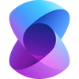

# Frameworks de Desarrollo para IA Generativa

Para trabajar con Inteligencia Artificial (AI) Generativa (GenAI) es importante elegir tanto el modelo que nos proporcionará las capacidades de generación como el _framework_ que nos proporcionará capacidades de integración.

Con el increíble ritmo de avance en la inteligencia artificial, estamos viendo el surgimiento de cada vez más _framework_ o marcos de trabaj para IA que las organizaciones y sus equipos pueden emplear para poner en marcha sus proyectos e iniciativas más rápidamente.

Muchos de estos _frameworks_ son proyectos de código abierto (_open-source_), algo que suele ocasinar desconfianza en algunas organizaciones al momento de adoptar un determinado marco de trabajo, aun cuando todas las contribuciones o cambios en dichos proyectos sean minuciosamente revisados antes de ser aprobados e integrados en la base de código. No obstante, ésto no tiene porqué ser así, ya que en el fondo, grandes empresas como Microsoft por ejemplo, están detrás de estos proyectos tanto de forma directa, como árbitro o patrocinador, asegurando que los niveles de calidad sean tales que garanticen los aspectos de seguridad, soporte y funcionalidad de en cada _framework_.

## ¿Qué son los marcos de trabajo o _framewoks_ de GenAI?

Son colecciones de bibliotecas (librerias) que trabajan juntas para facilitar la integración con modelos de GenAI y el despliegue de aplicaciones o servicios enriquecidos con estas tecnologías. Son los ingredientes fundamentales para construir sistemas avanzados e inteligentes que pueden aprender, adaptarse y evolucionar. Son parte de cualquier arquitectura moderna que haga uso de este tipo de herramientas.

La ventaja principal y más significativa de estos _frameworks_ es la estandarización del flujo de trabajo de desarrollo. Esto asegura que, independientemente del proyecto de IA, los desarrolladores tengan acceso a un conjunto de herramientas y metodologías estandarizadas. Esta uniformidad permite la integración fluida de elementos de IA en diversas plataformas y aplicaciones.

### Beneficios de los marcos de trabajo o _framewoks_ de GenAI

Los _framewoks_ de IA establecen la base para el uso de algoritmos para la realización de tareas habituales tales como extracción de palabras o frases claves, resúmenes, traducciones o formateos. También facilitan significativamente la integración con modelos de IA como los LLMs (Large Language Models) para el proceso de desarrollo de sistemas inteligentes. En general, estos _framewoks_ aportan los siguientes beneficios:

1.  **Rentabilidad**

    Los _framewoks_ de IA proporcionan una forma rentable para que las organizaciones creen aplicaciones personalizadas. Los _framewoks_ son cruciales para reducir los costos de desarrollo, ya que eliminan la necesidad de una codificación manual considerable y brindan a los desarrolladores componentes listos para usar o reutilizar.

2.  **Ahorro de tiempo**

    Los _framewoks_ de IA benefician enormemente el desarrollo de software moderno, acelerando la invención, evaluación y despliegue de aplicaciones. Ofrecen un ecosistema de desarrollo integral que incluye depuradores, marcos de prueba y herramientas de visualización de datos. Esto acorta el tiempo de implementación, permitiendo a los desarrolladores avanzar más rápido. Además, los _framewoks_ de IA proporcionan una gran selección de modelos predesarrollados o mecanismos de integración con los modelos más populares.

3.  **Flujo de desarrollo de aplicaciones**

    Al seleccionar _framewoks_, la capacidad de mejorar y acelerar el desarrollo es crítica. Los _framewoks_ de IA incluyen algoritmos precodificados, utilidades de gestión de datos y metodologías de optimización, permitiendo a los desarrolladores centrarse en la resolución de problemas fundamentales en lugar de en las complejidades de la dinámica de IA.

## ¿Cómo elegir el marco o _framewoks_ de GenAI (más) adecuado?

Dado el gran número de _framewoks_ de IA disponibles, seleccionar el adecuado para tu proyecto puede ser difícil. Por lo tanto, antes de profundizar en las opciones disponibles, tiene sentido considerar algunos criterios que ayudarán a tomar una decisión (más) informada.

1. **Rendimiento**

    La velocidad y escalabilidad de un _framewok_ varían según su implementación, determinando su elegibilidad para la computación distribuida y el uso de hardware, como los CPUs o GPUs.

2. **Soporte de la comunidad**

    La comunidad del _framewok_ crece junto con su popularidad. Una comunidad activa puede ayudar en cualquier momento que se experimente un problema, una incidencia o se necesite aclaraciones sobre cómo funciona algo.

3. **Flexibilidad**

    Un _framewok_ de IA flexible permite la creación rápida de prototipos y modificaciones, lo cual es crítico para satisfacer las necesidades cambiantes de la investigación (como la realización de Pruebas de Concepto) y las aplicaciones.

4. **Facilidad de aprendizaje**

    Algunos _framewoks_ proporcionan una API de alto nivel que facilita el entrenamiento de modelos de aprendizaje automático, mientras que otros tienen una curva de aprendizaje más pronunciada. Una organización puede evaluar la dificultad revisando lecciones específicas y ejemplos de código, algo muy común en implementaciones abiertas (_open-source_).

## Integración de marcos o _framewoks_ de GenAI con otras herramientas

### Integración con servicios en la nube

La Inteligencia Artificial y la computación en la nube están estrechamente entrelazadas. Los servicios públicos en la nube hoy en día tienen configuraciones y modelos preconfigurados para facilitar la prueba y el despliegue de aplicaciones de IA.

### Marcos de IA en flujos o _pipelines_ de DevOps

Cada vez más equipos están utilizando soluciones de IA para automatizar y optimizar los procesos de desarrollo y entrega de software. Esto incluye la automatización de pruebas y despliegues, y la mejora de la gestión de recursos y la seguridad.

Las organizaciones que emplean IA en DevOps ganan velocidad, precisión y fiabilidad en el ciclo de vida del desarrollo de software. Esto, a su vez, resulta en despliegues más rápidos, menos errores y una mayor productividad general.

### Marcos y herramientas de visualización

Al usar herramientas de análisis impulsadas por IA, puedes hacer más que visualizar datos. El futuro del descubrimiento de datos gira en torno a explorar, interactuar y comprometerse con tus datos. Como resultado, puedes descubrir tendencias subyacentes que pueden no ser visibles en representaciones estáticas pre-pobladas. Con capacidades avanzadas de IA y aprendizaje automático, todos los usuarios pueden tener acceso a los datos y beneficiarse de paneles interactivos.

### Automatización del despliegue de IA

La IA está integrada en varias etapas del ciclo de vida de DevOps, cada una con beneficios únicos. Un área donde la IA está teniendo un impacto significativo es en la monitorización inteligente y la detección de anomalías. Los sistemas de IA pueden escanear grandes volúmenes de datos en tiempo real para encontrar patrones y anomalías que pueden sugerir problemas antes de que se vuelvan significativos. La monitorización proactiva permite a los equipos prevenir problemas, minimizar el tiempo de inactividad y mejorar la fiabilidad del sistema.

## Marcos o _framewoks_ más populares

Hay muchísimos, con lo cual nos centraremos en dos de los más populares en términos de comunidad, uso en organizaciones a nivel comercial, soporte y capacidades dentro del mundo de la GenAI.

1. **Lang Chain**

    

    Podríamos decir que es el marco de trabajo o _framework_ con la comunidad más grande en estos momentos. Ofrece capacidades de integración con LLMs en varios lenguajes de programación, siendo el principal Python y JavaScript, y existiendo versiones para otros lenguajes como C#.

    Al ser un proyecto comunitario, a veces adolece de mucho caos entre las versiones, aunque últimamente lo están haciendo mejor desde la salida de `LangGraph` (la parte de pago).

2. **Semantic Kernel**

    

    Es una librería completamente de código abierto (_open-source_) arbitrada por Microsoft que, aunque podríamos decir que nació para competir con LangChain, a evolucionado para ocupar su propio nicho funcional. Al igual que LangChain proporciona facilidades para integrar aplicaciones con LLMs en varios lenguajes de programación, siendo el principal C#, y luego Python, Java y JavaScript.
