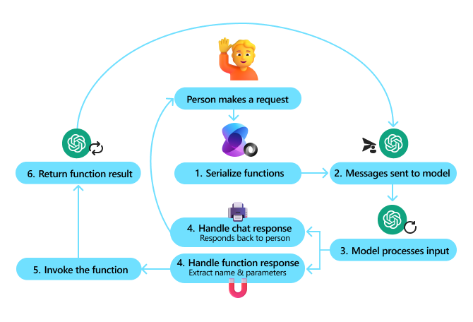

# Funciones, Planificadores, Agentes, Asistentes y Copilots

En el vasto y dinámico mundo de la Inteligencia Artificial y la automatización, los términos "Agentes", "Asistentes", "Copilots" y "Planificadores" se han convertido en pilares fundamentales que están transformando la manera en que interactuamos con la tecnología y gestionamos nuestras tareas diarias. Cada uno de estos conceptos representa una faceta única de la evolución tecnológica, diseñada para mejorar la eficiencia, la productividad y la experiencia del usuario en diversos contextos.

- **Funciones**: Son componentes programáticos, con o son enriquecimiento de Inteligencia Artificial, que proporcionan una acción específica sobre un dominio de conocimiento o ámbito de datos.

- **Planificadores**: Son algoritmos que ayudan a las Inteligencias Artificiales a simular la toma de desiciones sobre que acciones realizar para satisfacer las solicitudes de un usuario. Habitualmente, los planificadores utilizan estrategias de _Prompt Engineering_ junto con otras capacidades de IA para determinar que funciones invocar y en qué orden para cumplir con el objetivo que les pide un usuario.

- **Agentes**: Los agentes componentes que actúan en nombre de un usuario o de otro programa, realizando tareas específicas de manera autónoma. Estos agentes pueden ser simples, como los que gestionan correos electrónicos, o complejos, como los que analizan grandes volúmenes de datos para extraer información relevante. Su principal característica es la capacidad de operar de manera independiente, tomando decisiones basadas en reglas predefinidas o en aprendizaje automático. La gran mayoría de las veces, un agente no es más que una integración con un API.

- **Asistentes**: Los asistentes son orquestadores de agentes, que utilizan procesamiento de lenguaje natural (NLP, _Natural Processing Language_) para interactuar con los usuarios de manera conversacional. Estos asistentes pueden realizar una amplia gama de tareas, desde responder preguntas triviales hasta controlar dispositivos inteligentes en el hogar, la mayoría de las veces delegando en uno o más agentes su ejecución o realización. Su objetivo principal es facilitar la vida del usuario.

- **Copilots**: Los copilots son un tipo sofisticado de asistente, representando de hecho una evolución de éstos, integrándose profundamente en las herramientas y flujos de trabajo existentes para ofrecer una asistencia más contextual y proactiva. Estos copilots no solo responden a comandos directos, sino que también anticipan las necesidades del usuario, sugiriendo acciones, automatizando tareas repetitivas y proporcionando _insights_ basados en datos. Su integración con plataformas como Microsoft 365 permite a los usuarios optimizar sus procesos de trabajo sin necesidad de cambiar de aplicación o entorno.

En conjunto, estos elementos están redefiniendo la interacción humano-máquina, haciendo que nuestras interacciones con la tecnología sean más intuitivas, eficientes y productivas. A medida que la Inteligencia Artificial continúa avanzando, podemos esperar que los agentes, asistentes, copilots y planificadores se vuelvan aún más sofisticados, ofreciendo niveles de personalización y automatización sin precedentes.

## Function Calling

La característica más eficaz de un chat con GenAI es la capacidad de llamar a funciones (en inglés, _Function Calling_) desde el modelo. Esto permite crear, por ejemplo, un chatbot que puede interactuar con diversas fuentes de datos y sistemas, automatizando procesos empresariales, crear fragmentos de código, etc.

Hoy día, un modelo LLM no sólo es capaz de indicar que funciones quiere invocar, sino que tiene mecanismos de auto-invocación para realizar estas llamadas y procesar los resultados de forma autónoma.

El _Function Calling_ es la pieza fundamental que da cabida a la construcción de Asistentes, Agentes y Copilots.

Ejemplo 2
- Contar un Chiste
- Busqueda en Bing
- Crear una imagen con dall-e-3
