# ¿Esto cómo lo probamos?

Los Modelos de Lenguaje Grande (LLMs, por sus siglas en inglés) son increíblemente útiles para generar textos en lenguaje natural para tareas como resumen, traducción, respuesta a preguntas y generación de textos. Sin embargo, no siempre son perfectos y, a veces, pueden producir resultados inexactos, irrelevantes, sesgados o incluso perjudiciales. Por eso es muy importante evaluar los resultados de los LLMs para asegurarse de que cumplan con los estándares de calidad y ética necesarios para su uso previsto.

Imagina que estás utilizando un LLM para ayudar a crear contenido para un sitio web. Sin una evaluación adecuada, el modelo podría generar un texto que no se ajuste al tono que buscas, o peor aún, podría incluir información sesgada o incorrecta. Aquí es donde entran en juego los flujos de evaluación. Estos procedimientos sistemáticos te ayudan a evaluar y mejorar los resultados del LLM, facilitando la detección y corrección de errores, sesgos y riesgos potenciales. Además, los flujos de evaluación pueden proporcionar retroalimentación y orientación valiosa, ayudando a los desarrolladores y usuarios a alinear el rendimiento del LLM con los objetivos empresariales y las expectativas de los usuarios. Al incorporar pasos de evaluación, puedes asegurar una experiencia más confiable y amigable para todos los involucrados.

En este módulo, explicaremos qué son los flujos de evaluación (Evaluation Flow) y cómo podemos implementarlos en Azure AI Studio. Comenzaremos señalando las motivaciones para evaluar los resultados de los LLMs y proporcionaremos algunos ejemplos de situaciones empresariales donde la ausencia de evaluación puede ocasionar problemas para el negocio. Luego, describiremos los componentes principales y los pasos de los flujos de evaluación y mostraremos cómo usar Azure AI Studio para crear y ejecutar flujos de evaluación para LLMs. Finalmente, discutiremos algunas mejores prácticas y desafíos de los flujos de evaluación y proporcionaremos recursos para seguir aprendiendo.

## Motivaciones para Evaluar los Resultados de los LLMs

Evaluar los resultados de los LLMs es crucial por varias razones. Primero y principal, garantiza la calidad y la precisión de los textos que generan. Imagina utilizar un LLM para crear descripciones de productos. Sin una evaluación adecuada, el modelo podría generar descripciones que sean engañosas, inexactas o irrelevantes para las características del producto. Al evaluar los resultados del LLM, puedes detectar y corregir estos errores, mejorando la calidad y la precisión general del texto.

Otro aspecto importante es asegurar la responsabilidad ética y social de los textos generados. Los LLMs, en ocasiones, pueden generar contenido sesgado, ofensivo, perjudicial o incluso ilegal. Por ejemplo, si se utiliza un LLM para redactar artículos de noticias, podría generar inadvertidamente un texto que sea racista, sexista o difamatorio. Evaluar los resultados ayuda a identificar y mitigar estos sesgos y riesgos, garantizando que los textos sean éticos y socialmente responsables.

Es esencial que los resultados del LLM se alineen con los objetivos del negocio y las expectativas de los usuarios. Imagina un LLM generando correos electrónicos de marketing. Sin evaluación, estos correos podrían resultar demasiado formales, demasiado informales o simplemente demasiado genéricos, fallando por completo en su objetivo. Al evaluar los resultados, puedes optimizar su impacto y relevancia, asegurándote de que cumplan efectivamente los objetivos del negocio y resuenen con la audiencia objetivo.

No evaluar los resultados de un LLM puede llevar a problemas serios para una empresa. Por ejemplo, si los textos generados son de baja calidad, poco éticos o irrelevantes, los clientes y usuarios podrían perder la confianza y el interés. Considera un LLM que produzca reseñas de productos falsas o sesgadas. Los clientes probablemente dejarían de confiar en esas reseñas e incluso podrían acudir a la competencia.

Además, si el LLM genera contenido dañino, ofensivo o ilegal, la empresa podría enfrentarse a repercusiones legales, regulatorias o sociales. Imagina un LLM generando artículos de noticias difamatorios o falsos; la empresa podría terminar enfrentando demandas, multas o boicots, dañando gravemente su reputación y credibilidad.

Finalmente, la efectividad de los resultados de los LLMs impacta directamente en la ventaja competitiva y la rentabilidad de una empresa. Si los textos no son persuasivos, personalizados o atractivos—como en el caso de los correos electrónicos de marketing—la empresa podría no lograr incrementar las ventas, las conversiones o las tasas de retención, perdiendo así su ventaja en el mercado.

## Mejores Prácticas y Desafíos de los Flujos de Evaluación

Los flujos de evaluación para los LLMs no son triviales ni sencillos, y conllevan varias mejores prácticas y desafíos que los usuarios deben conocer y abordar, tales como:

- Definir metas y objetivos de evaluación claros y realistas. Los usuarios deben especificar qué quieren evaluar, por qué quieren evaluar y cómo quieren evaluar, alineando sus metas y objetivos de evaluación con los objetivos empresariales y las expectativas de los usuarios.

- Elegir datos y métricas de evaluación apropiados y confiables. Los usuarios deben seleccionar datos y métricas que sean representativos, diversos y suficientes para la tarea de evaluación, y asegurarse de que sean relevantes, fiables y válidos para dicha tarea.

- Elegir métodos y acciones de evaluación apropiados y robustos. Los usuarios deben seleccionar métodos y acciones que sean adecuados, robustos y escalables para la tarea de evaluación, y asegurarse de que sean transparentes, explicables y responsables en cuanto a los resultados y el impacto de la evaluación.

- Realizar una evaluación iterativa y continua. Los usuarios deben llevar a cabo la evaluación de manera iterativa y continua, actualizando y refinando sus datos, métricas, métodos y acciones de evaluación según la retroalimentación y los hallazgos obtenidos.

- Colaborar y comunicarse con las partes interesadas. Los usuarios deben colaborar y comunicarse con varias partes interesadas, como desarrolladores, usuarios, clientes y reguladores, e involucrarlos en el proceso y resultados de la evaluación, abordando sus necesidades, preocupaciones y expectativas.

Los flujos de evaluación para los LLMs son una parte esencial y valiosa del ciclo de vida de los LLMs, y pueden ayudar a los usuarios a garantizar la calidad, ética y efectividad de los resultados de los LLMs, así como a lograr los resultados y objetivos deseados en los casos de uso. En general, existen varias formas de implementar flujos de evaluación, pero la mejor estrategia siempre se basará en el uso de herramientas adecuadas para gestionar, desplegar y monitorear tanto el comportamiento del LLM como sus flujos de evaluación. Y contamos con la herramienta adecuada para hacerlo.

## ¿Cómo evaluar un flujo usando Prompt Flow en Azure AI Foundry? 

Vamos a profundizar en la implementación de varios métodos de evaluación que ofrece Prompt Flow utilizando la demo "Chat con Wikipedia".

Primero, configuramos nuestras credenciales de Azure OpenAI en la sección de "Connected resources" del Management Center de Azure AI Foundry, que es una forma segura de almacenar secretos en Prompt Flow.

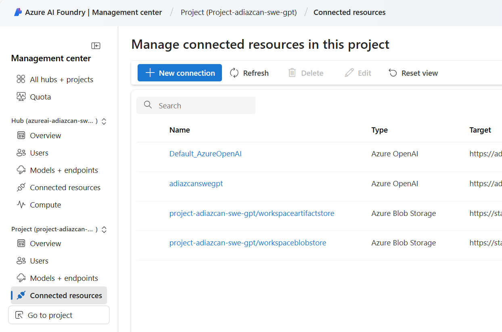

Luego, creamos un nuevo flujo utilizando la opción Clonar en la plantilla "Chat con Wikipedia":

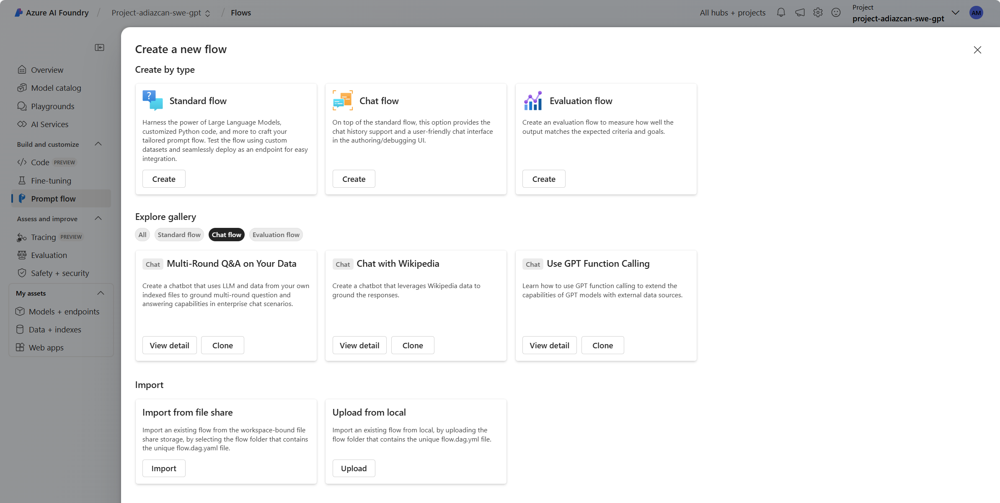

Después de actualizar la Conexión en los nodos LLM, agrega otra salida llamada "contexts" con el valor `${process_search_result.output}`. Necesitaremos esto para la asignación de entradas al configurar nuestros flujos de Evaluación.

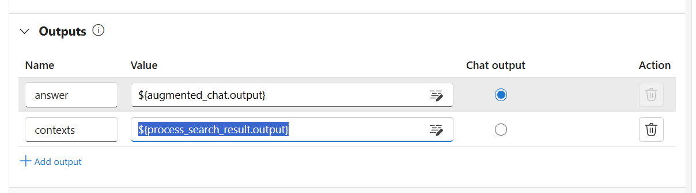

Prompt Flow acepta varios formatos de archivos de entrada, vamos a utilizar un `.jsonl`. El flujo "Chat con Wikipedia" espera la conversación inicial y una pregunta como entrada. También añadiremos un campo `ground_truth` para especificar la respuesta verdadera.

```json
{
    "chat_history": [{
        "inputs": {
            "question": "What is the Big Bang Theory?"
        }, 
        "outputs": {
            "answer": "The Big Bang Theory is a widely accepted cosmological model that explains the observable universe's origin and development. It proposes that the universe began as a hot, dense point approximately 13.8 billion years ago and has been expanding ever since."
        }
        }],
    "question": "What is the evidence supporting this theory?",
    "ground_truth": "The Big Bang Theory is supported by various pieces of evidence, including the cosmic microwave background radiation, the abundance of light elements in the universe, and the large-scale structure of the cosmos."
}
```

Abre el fichero  [`test-dataset.jsonl`](test-dataset.jsonl) y revisa el contenido con el conjunto de preguntas y respuestas que vamos a usar para probar el flujo. 

Ahora, inicia un runtime automático, haz clic en "Evaluar" e inicie una evaluación automatizada. Sube el archivo [`test-dataset.jsonl`](test-dataset.jsonl) confirma que el JSON se haya analizado correctamente observando la sección de vista previa.

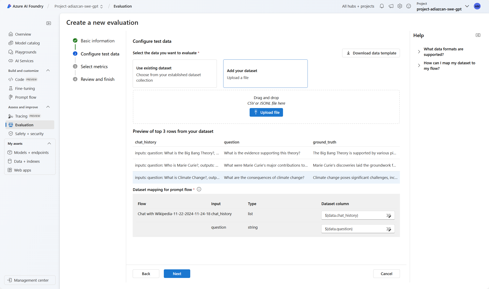

Luego, selecciona todas las opciones de métricas asistidas por AI.

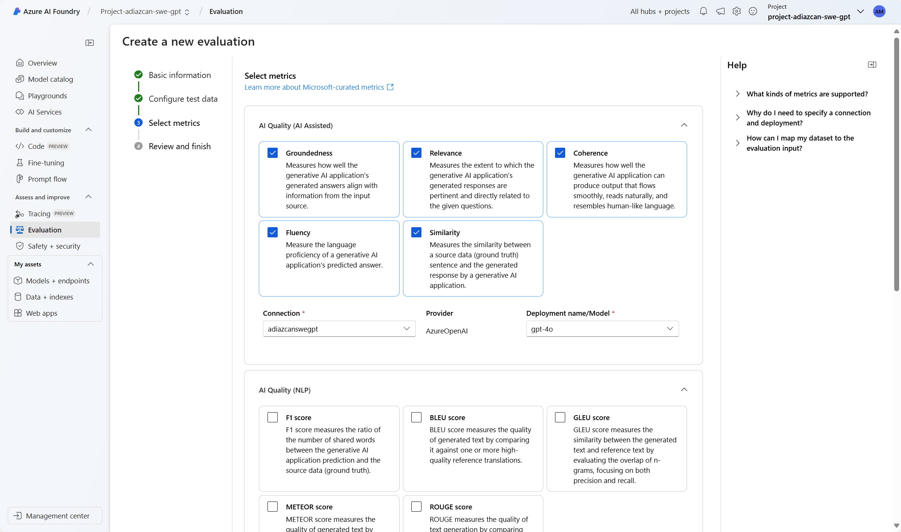

Configura las columnas de datos para que coincidan con las entradas necesarias para generar las métricas de evaluación. Selecciona las opciones correspondientes desde el menú desplegable.

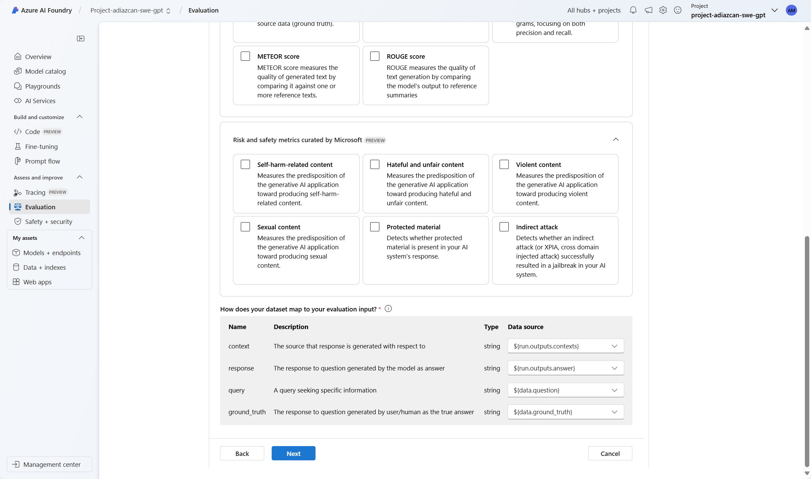

Finalmente, inicia la evaluación y espera a que se complete. 

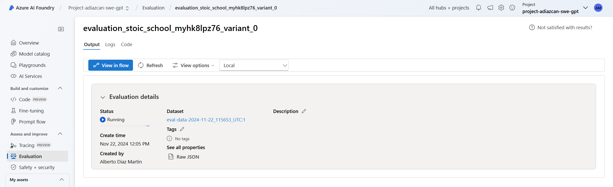

Una vez que la evaluación haya finalizado, puedes ver los resultados en el panel de las métricas de evaluación.

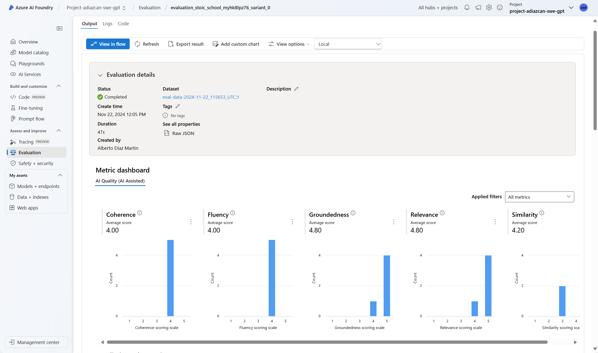

- La fundamentación (Groundedness) es el grado en el que una respuesta de un modelo de lenguaje está basada e informada por el contexto proporcionado en el prompt. La fundamentación, en particular con la Generación Aumentada por Recuperación (Retrieval Augmented Generation), es una técnica comúnmente utilizada para reducir la alucinación en los LLMs y complementar su base de conocimientos interna (desarrollada durante el entrenamiento) proporcionando información nueva o específica para el caso de uso como parte del prompt.

- La coherencia (Coherence) se refiere a la calidad del texto en cuanto a que se lea de manera natural y se asemeje al lenguaje humano. Una baja coherencia implica oraciones que parecen desconectadas y carecen de un flujo lógico, lo cual dificulta que los lectores comprendan el mensaje que se quiere transmitir.

- La relevancia (Relevance) mide hasta qué punto el modelo responde a la pregunta del usuario considerando el contexto. Una baja relevancia implica que la respuesta del modelo está fuera de tema y no aborda de manera efectiva la consulta del usuario.

- La fluidez (Fluency) evalúa la competencia lingüística, y la Similaridad GPT mide la semejanza semántica entre la respuesta verdadera (`ground_truth`) y la respuesta del modelo.

- Similaridad (Similarity) es otra forma de calcular la similitud entre la respuesta verdadera (`ground_truth`) y la respuesta del modelo. 

¡Y eso es todo! Has creado y ejecutado un flujo de evaluación utilizando Prompt Flow en Azure AI Foundry. Ahora puedes explorar y experimentar con diferentes flujos de evaluación y métricas para mejorar la calidad y la precisión de tus LLMs.

## ¿Cómo crear un flujo de evaluación en Azure AI Foundry?

La evaluación tiene dos componentes principales: el conjunto de datos de evaluación y una métrica. A continuación se muestra lo que puedes hacer con Prompt Flow con un conjunto de datos de evaluación de verdad (`ground_truth`) para un caso de uso de preguntas y respuestas con Generación Aumentada por Recuperación (RAG QnA).

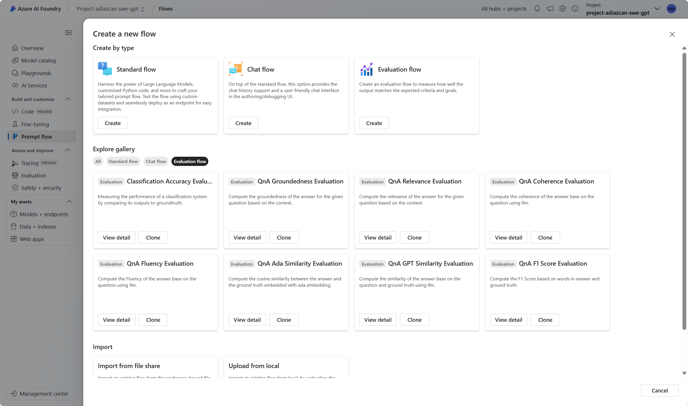

A continuación, se presentan algunas de las capacidades de evaluación automática que ofrece Azure AI Foundry. Con estos flujos de evaluación, podemos usar prompts para evaluar diferentes características de las generaciones del modelo, como la fluidez, relevancia, coherencia o fundamentación, asignando calificaciones de 1 a 5 a cada característica utilizando flujos especialmente diseñados.

- **Evaluación de Similaridad QnA Ada:** Puedes calcular la similitud coseno entre la respuesta del LLM y la respuesta verdadera (`ground_truth`) utilizando la incrustación ada. `ada_similarity` es un valor en el rango [0, 1].

- **Fluidez QnA GPT:** Mide qué tan gramatical y lingüísticamente correcta es la respuesta predicha por el modelo. A continuación se presenta parte del prompt utilizado para calificar la fluidez de las respuestas del modelo: "La fluidez mide la calidad de las oraciones individuales en la respuesta y si están bien escritas y son gramaticalmente correctas. Considera la calidad de las oraciones individuales al evaluar la fluidez. Dada la pregunta y la respuesta, califica la fluidez de la respuesta entre una y cinco estrellas utilizando la siguiente escala de calificación:"

- **Fundamentación QnA GPT:** Mide qué tan fundamentadas están las respuestas predichas del modelo en el contexto proporcionado. Incluso si las respuestas del LLM son ciertas, si no son verificables con el contexto, dichas respuestas se consideran no fundamentadas.

- **Coherencia QnA GPT:** Puede usarse con sistemas RAG y permite que GPT-35-Turbo mida la calidad de todas las oraciones en una respuesta predicha por el modelo y cómo encajan de manera natural. A continuación se muestra parte del prompt utilizado para calificar la coherencia de las respuestas del modelo: "La coherencia de una respuesta se mide por lo bien que todas las oraciones encajan entre sí y suenan de forma natural en conjunto. Considera la calidad general de la respuesta al evaluar la coherencia. Dada la pregunta y la respuesta, califica la coherencia de la respuesta entre una y cinco estrellas utilizando la siguiente escala de calificación:"

- **Relevancia QnA GPT:** GPT mide qué tan relevantes son las respuestas a las preguntas planteadas. A continuación se presenta parte del prompt para calificar la relevancia de las respuestas del modelo: "La relevancia mide qué tan bien la respuesta aborda los aspectos principales de la pregunta, en función del contexto. Considera si todos y solo los aspectos importantes están contenidos en la respuesta al evaluar la relevancia. Dado el contexto y la pregunta, califica la relevancia de la respuesta entre una y cinco estrellas utilizando la siguiente escala de calificación:"

- **Similaridad QnA GPT:** GPT mide las generaciones del modelo en comparación con las respuestas verdaderas (`ground_truth`). A continuación se muestra parte del prompt para calificar la similitud de las respuestas del modelo: "La equivalencia, como métrica, mide la similitud entre la respuesta predicha y la respuesta correcta. Si la información y el contenido en la respuesta predicha son similares o equivalentes a la respuesta correcta, entonces el valor de la métrica de equivalencia debe ser alto; de lo contrario, debe ser bajo. Dada la pregunta, la respuesta correcta y la respuesta predicha, determina el valor de la métrica de equivalencia utilizando la siguiente escala de calificación:"

- **Predicción de Puntuación F1 QnA:** Puntuación F1 basada en el conteo de palabras en la respuesta predicha y la respuesta verdadera (`ground_truth`).

- **Evaluación por Pares de Puntuaciones de Relevancia QnA:** Este es un flujo que evalúa la calidad de las respuestas generadas por un sistema de preguntas y respuestas. Involucra asignar puntuaciones de relevancia a cada respuesta en función de qué tan bien coincide con la pregunta del usuario, comparando diferentes respuestas con una respuesta de referencia y agregando los resultados para producir métricas como tasas promedio de éxito y puntuaciones de relevancia.

Desde el flujo de Chat con Wikipedia, haz clic en "Evaluar" e inicie una evaluación personalizada. Sube el archivo [`test-dataset.jsonl`](test-dataset.jsonl) confirma que el JSON se haya analizado correctamente observando la sección de vista previa.

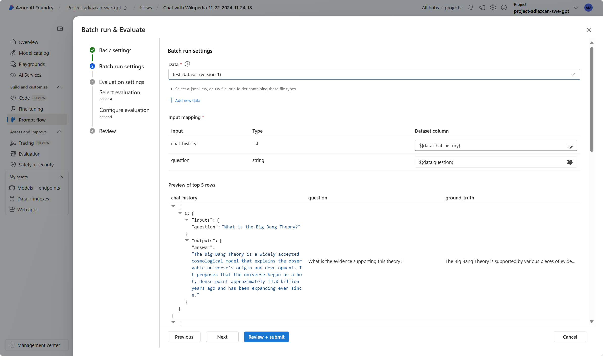

Luego, selecciona todas las opciones de métricas de evaluación automatizada, expecto "Evaluación de Precisión de Clasificación", ya que este no es un problema de clasificación. 

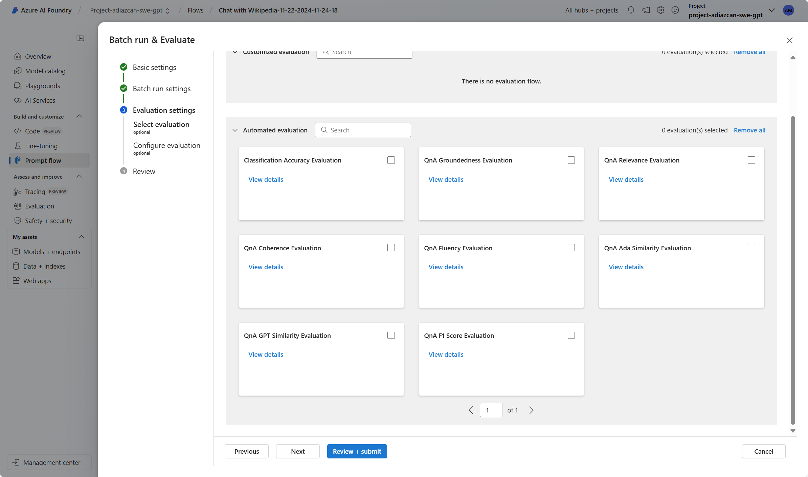

Configure cada uno de los evaluadores, para que obtengan los valores necesarios de métricas como contexto, conexión al modelo de embedding, etc. 

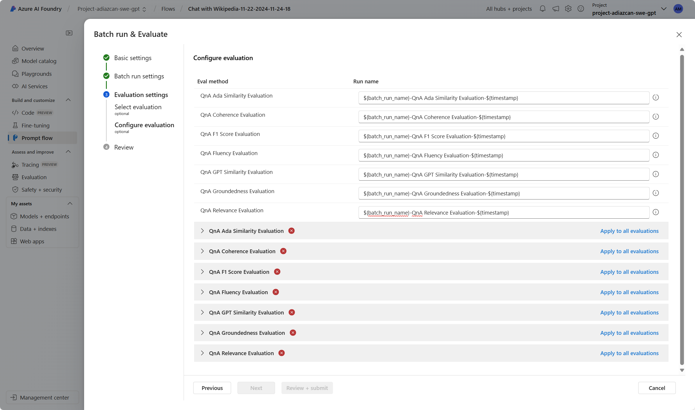

Finalmente, inicia la evaluación y espera a que se complete. 

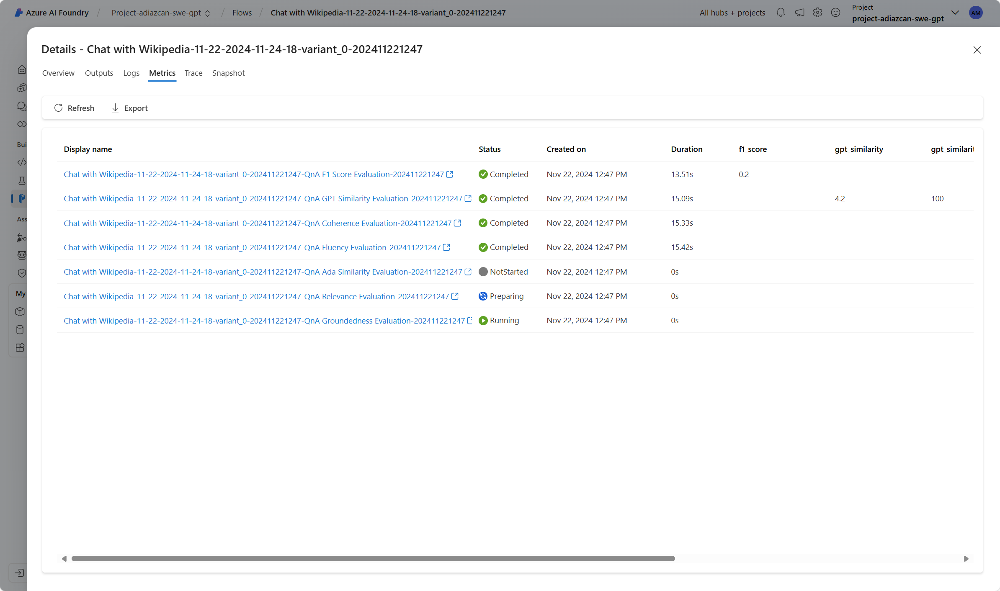

Una vez que la evaluación haya finalizado, puedes ver los resultados en el panel de las métricas de evaluación para cada uno de los evaluadores.

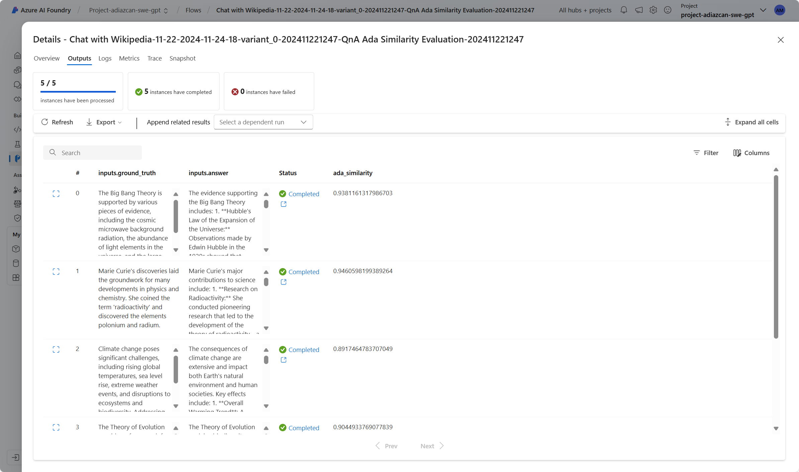